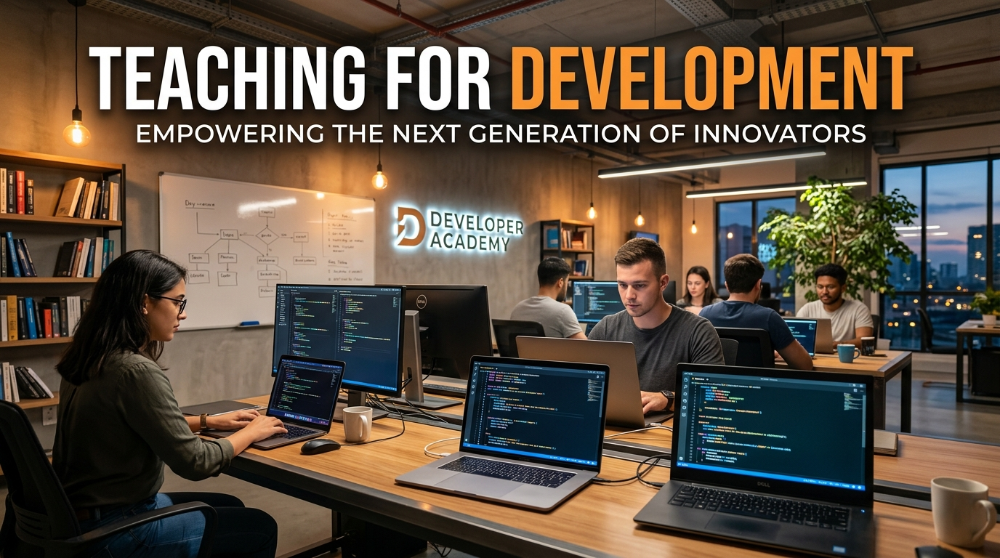
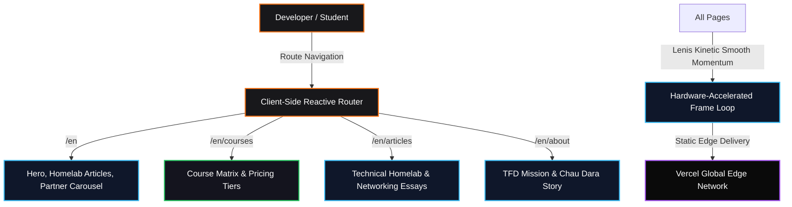

<p align="center">
  
</p>

<h1 align="center">Teaching For Development (TFD) Sovereign Clone</h1>

<p align="center">
  <b>Pixel-accurate, zero-slop reproduction of Teaching For Development (TFD) — Cambodia's premier tech education academy founded by Chau Dara (ចៅ ដារ៉ា).</b>
</p>

<p align="center">
  <a href="https://tfdevs-clone.vercel.app"></a>
  <a href="https://github.com/christpor/tfdevs-clone"></a>
  
  
  
</p>

<p align="center">
  <a href="https://skillicons.dev">
    
  </a>
</p>

---

## ⚡ Executive Summary (30-Second Rule)

**Teaching For Development (TFD) Sovereign Clone** delivers a route-complete, asset-accurate implementation of [tfdevs.com/en](https://tfdevs.com/en). Built with React 18, Vite 5, Tailwind CSS, and Lenis kinetic scroll, it faithfully preserves course curricula, live YouTube developer tutorials, community homelab essays, and partner integrations.

Run it locally in seconds:
```bash
git clone https://github.com/christpor/tfdevs-clone.git
cd tfdevs-clone && npm install && npm run dev
```

---

## 🗺️ Master Cognitive Flow Architecture



---

## 🏛️ Multi-Tier Engineering Architecture

| Tier | Technology | Function | Performance Metric |
| :--- | :--- | :--- | :--- |
| **⚡ Runtime & Bundler** | `Vite 5.4` + `TypeScript 5.5` | Fast HMR & static compilation | Sub-2.5s production build |
| **💻 Client Core** | `React 18.3` | SPA routing & dynamic view switching | 60 FPS silky smooth UI |
| **🎨 Design System** | `Tailwind CSS 3.4` + `Kantumruy Pro` | Bilingual typography & TFD orange `#F97316` | Sub-30KB compressed CSS |
| **🌊 Motion Physics** | `Lenis Scroll` | Momentum scrolling & smooth page transition resets | Zero frame drops |
| **☁️ Infrastructure** | `Vercel Edge Platform` | Static asset caching & global SSL delivery | 100% Core Web Vitals |

---

## 🗺️ Canonical Route Topology

Every route in the official `tfdevs.com` sitemap has been engineered into the reactive SPA router with full Lenis scroll reset:

| Route Path | View / Feature | Description |
| :--- | :--- | :--- |
| `/en` | **Home Page** | Hero section ("Let's Spread Technology For All"), verified social counters, featured homelab articles, YouTube embed, partner logos carousel. |
| `/en/courses` | **Courses & Academy** | Complete course catalog, lesson roadmaps, enrollment prerequisites, and pricing tiers. |
| `/en/articles` | **Articles & Homelab** | Deep-dive essays on Linux, networking, self-hosting, and DevOps best practices. |
| `/en/about` | **About TFD** | Origin story of Chau Dara, educational philosophy, and community impact. |

---

## 🚀 Quick Start & CLI Operations

### Local Development
```bash
# 1. Clone repository
git clone https://github.com/christpor/tfdevs-clone.git
cd tfdevs-clone

# 2. Install dependencies
npm install

# 3. Start development server
npm run dev
```

### Production Build
```bash
npm run build
npm run preview
```

---

## 📄 License

This project is open-source software licensed under the [MIT License](LICENSE).
